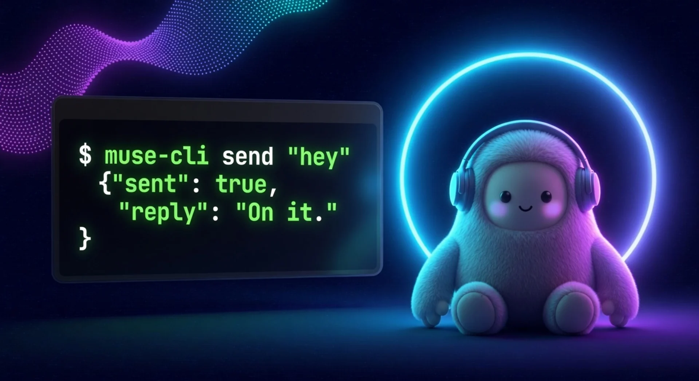
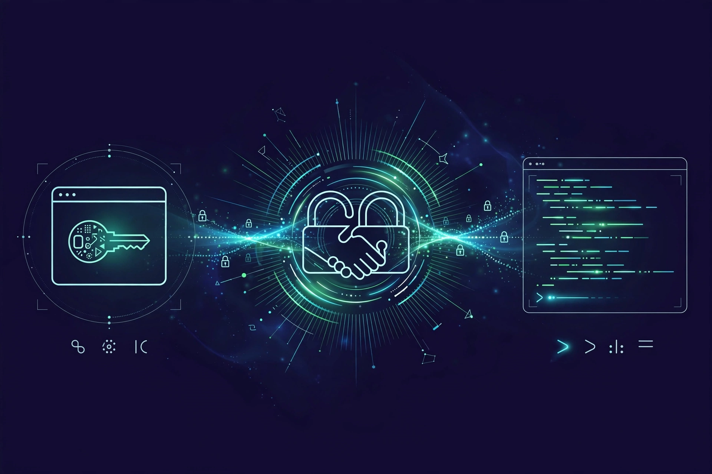
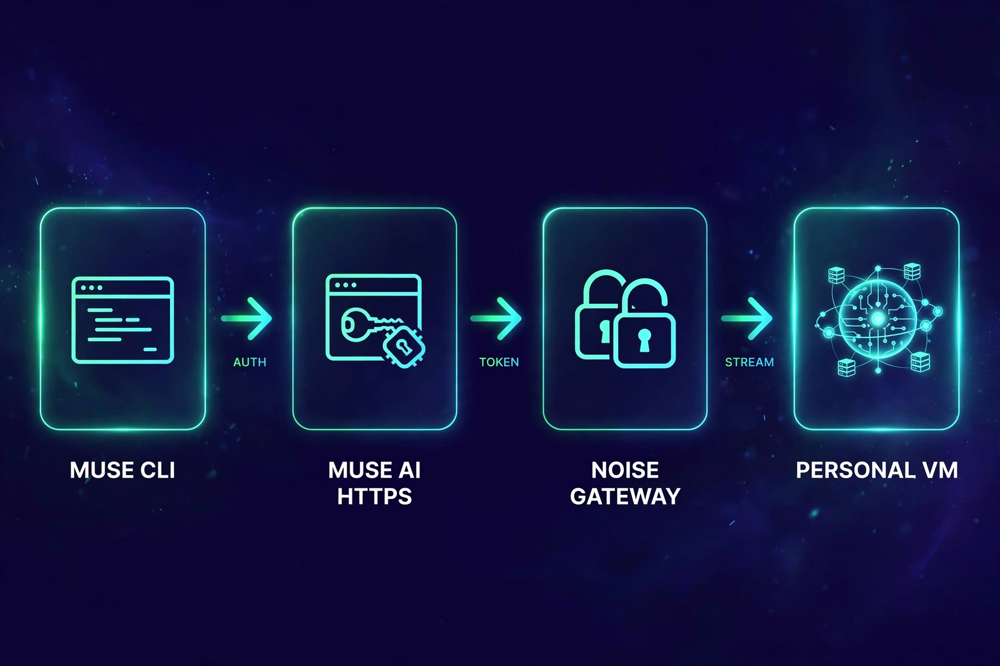

<div align="center">

# muse

Talk to your personal muse.ai agent from the terminal.

[](https://github.com/nikships/muse-cli/blob/main/LICENSE)
[](https://github.com/nikships/muse-cli/stargazers)



</div>

## What is this?

A CLI that manages your personal muse.ai agent without opening a browser. Send it messages, read chats and side chats, watch live events, and manage your feed, goals, ideas, and sessions. It speaks the app's own gateway protocol directly: HTTPS auth, then an encrypted Noise-XX WebSocket to your personal VM.

## Quick Start

```bash
git clone https://github.com/nikships/muse-cli.git
cd muse-cli
pip install -r requirements.txt

# 1. Log in to https://muse.ai/ in Chrome
# 2. Export your session (one time; re-run when it expires):
./cli.py auth export

./cli.py status
```

Tip: add it to your PATH under a non-clashing name (`muse` is taken by
Muse Code on many machines):

```bash
ln -s "$PWD/cli.py" ~/bin/muse-cli
muse-cli status
```

## Usage

```bash
./cli.py threads                                  # main chat + side chats
./cli.py history --limit 5                        # recent messages
./cli.py history --thread <session-id> --limit 5  # one side chat
./cli.py send "summarize my unread" --wait 120    # send + wait for the reply
./cli.py watch --timeout 60                       # tail live agent events

./cli.py feed --limit 5
./cli.py feed-react <unit-id> love
./cli.py goals
./cli.py ideas
./cli.py idea-exec <idea-id>                      # agent acts on the idea

./cli.py session-start --title "trip planning"    # new side chat
./cli.py session-rename <id> "new title"
./cli.py session-archive <id>                     # also: pin, unpin, unarchive, delete
./cli.py seen <thread-id>
./cli.py wake
./cli.py raw <method> --body '{}'                 # escape hatch: any of 258 gateway methods
```

Every command prints JSON. Your VM is auto-discovered from your session, and a
random device id is generated on first run.

## How it works





See [docs/PROTOCOL.md](docs/PROTOCOL.md) for the full protocol notes, including
the method table and the server quirks found during reverse engineering.

## Documentation

| Resource | Description |
|----------|-------------|
| [docs/PROTOCOL.md](docs/PROTOCOL.md) | Gateway protocol reference: auth chain, Noise transport, framing, method quirks |
| [routes.json](routes.json) | All 258 gateway methods with paths and services |
| `./cli.py raw --help` | Escape hatch for calling any gateway method directly |

## Project Structure

```
muse-cli/
assets/
docs/
LICENSE
README.md
cli.py
desc0.bin
desc1.bin
muse.py
requirements.txt
routes.json
```

- `cli.py` - argument parsing and all commands
- `muse.py` - gateway client (auth, Noise transport, subscriptions)
- `routes.json` - 258 gateway methods extracted from the web client
- `desc0.bin` / `desc1.bin` - protobuf descriptors for the wire framing
- `docs/PROTOCOL.md` - protocol reference for re-derivation
- `assets/` - README artwork (generated with Muse Image)

## Setup notes

- `auth export` reads cookies from a running Chrome via
  [agent-browser](https://github.com/nikships/foundry) (`npm i -g agent-browser`).
  No Chrome? Copy your `muse.ai` cookies into `~/.config/muse-cli/cookies.txt`
  by hand (Netscape jar or `name=value; ...` format, needs `hatch_sess`).
- Cookies live at `~/.config/muse-cli/cookies.txt` (mode 600). Access and
  gateway tokens are fetched fresh on every run, nothing long-lived is stored.
- Respect muse.ai's terms and rate limits. Internal APIs are unversioned and
  can change; if calls fail, re-derive from a fresh app bundle.

## Contributing

Issues and PRs welcome. If the protocol drifts, the most useful contribution
is a note of which method broke and the new server error text.

<a href="https://github.com/nikships/muse-cli/graphs/contributors">
  
</a>

## License

MIT. See [LICENSE](LICENSE).

---

<div align="center">

[](https://star-history.com/#nikships/muse-cli&Date)

</div>
